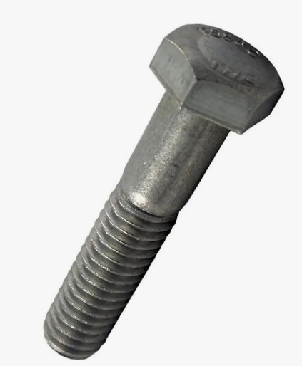
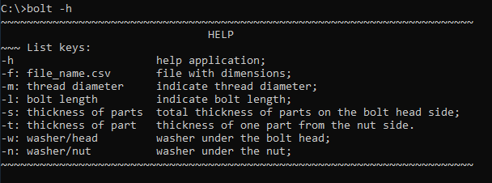
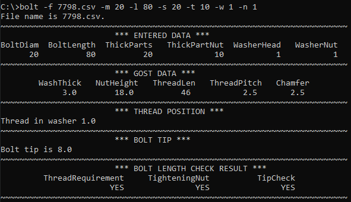
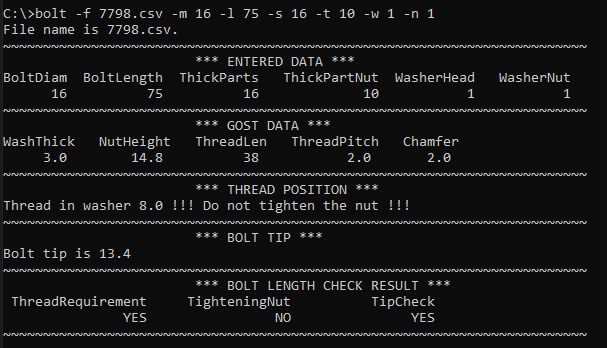
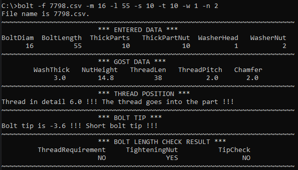

## Многомодульная программа
### Консольное приложение "Проверка длины болта по ГОСТ 7798-70"

#### Цель разработки:

Устранение появления возможных ошибок при работе с болтовыми соединениями в программе Tekla Structures и ручном подборе длины болта. 

#### Описание возможной ошибки: 
При копировании болтов "в другой объект", в случае изменения толщин соединяемых деталей, Tekla Structures программно не меняет длину болта в сторону уменьшения или увеличения. Формально болт продолжает соединять детали, но имеет некорректную длину. Игнорирование проверки длины болта приведёт к тому, что на монтаже будет невозможно закрутить гайку (длинный болт), либо резьба будет заходить в крайнюю к гайке деталь более 0,5t (короткий болт).

#### Приложение позволяет проверить длину болта по следующим параметрам:

* расположении резьбы болта на глубине не более 0,5t в ближней к гайке детали;
* возможность закручивания гайки (резьба болта не выходит из шайбы);
* размер выхода резьбы болтов из гаек.

#### Приложение имеет справку:

#### Приложение обрабатывает следующие аргументы командной строки:

* -h Описание функционала приложения;
* -f <filename.csv> Указание входного файла *.csv для обработки.
* -m Указание диаметра болта;
* -l Указание длины болта;
* -s Указание суммарной толщины соединяемых деталей за исключением толщины ближней к гайке детали;
* -t Указание толщины ближней к гайке детали;
* -w Указание количества шайб под головкой болта;
* -t Указание количества шайб под гайками;

#### Сборка приложения осуществляется при помощи утилиты make.

#### Файл для тестирования работы приложения:

* 7798.csv

#### Примеры работы приложения:

* длина болта удовлетворяет всем перечисленным требованиям

* резьба болта выходит из шайбы, гайка не закрутится

* резьба болта входит в ближнюю к гайке деталь более чем на 0,5t, резьбовой конец короткий

#### Реализована проверка следующих входных параметров:

* контроль диаметра болта;

* контроль длины болта по ГОСТ 7798-70.

#### Состав репозитория:
<url> &#128194; bolt_check </url> - файлы проекта

<url> &#128194; images </url> - файлы *.png для README.md

(<a href="#readme-top">вверх</a>)

